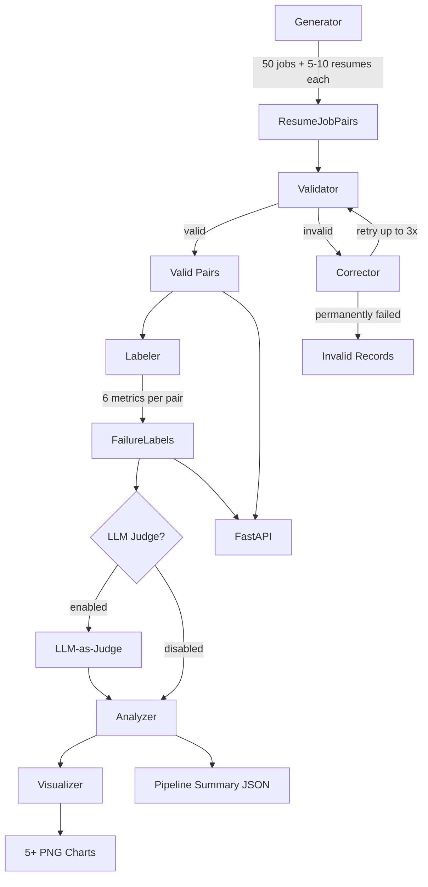

# Resume-Job Synthetic Data Pipeline

## Project Location

`mini-projects/02-resume-job-pipeline/` -- completely standalone, no shared code with other projects.

## Status

| Phase | Description | Status |
|-------|-------------|--------|
| 1 | Pydantic schemas (Resume, Job, Pair, Labels, ValidationResult) + config + normalizer + tests | pending |
| 2 | LLM client, 5 prompt templates, job + resume generators with controlled fit levels | pending |
| 3 | Schema validation with error categorization (missing fields, type mismatch, format violation, logical inconsistency) | pending |
| 4 | 6 failure metrics (Jaccard, experience, seniority, core skills, hallucination, awkward language) + tests | pending |
| 5 | Correction loop -- LLM re-generation from errors, max 3 retries, track success rate | pending |
| 6 | Analyzer + 5+ visualizations (correlation matrix, by fit level, by template, niche vs standard, schema heatmap) | pending |
| 7 | LLM-as-Judge -- hallucination, awkward language, quality score, fit assessment, recommendations | pending |
| 8 | FastAPI -- POST /review-resume, GET /health, GET /analysis/failure-rates + tests | pending |
| 9 | CLI run_pipeline.py orchestrator with --mode flag, progress tracking, JSONL/JSON/PNG outputs | pending |

## Directory Structure

```
mini-projects/02-resume-job-pipeline/
  PLAN.md
  README.md
  requirements.txt
  .env.example
  run_pipeline.py              # CLI orchestrator (--mode generate|validate|label|correct|analyze|all)
  pipeline/
    __init__.py
    config.py                  # pydantic-settings: env vars, defaults, paths
    client.py                  # OpenAI + Instructor client factory
    schemas/
      __init__.py
      resume.py                # ContactInfo, Education, Experience, Skill, Resume
      job.py                   # Company, JobRequirements, JobDescription
      pair.py                  # FitLevel enum, WritingStyle enum, ResumeJobPair, PairMetadata
      labels.py                # FailureLabels (6 metrics), JudgeResult
      validation.py            # ValidationError categories, ValidationResult
    generator.py               # generate_jobs(), generate_resumes_for_job()
    templates.py               # 5 prompt templates (formal, casual, technical, achievement, career-changer)
    validator.py               # validate_pair(), categorize_errors()
    normalizer.py              # normalize_skill(), jaccard_similarity()
    labeler.py                 # label_pair() -- all 6 failure metrics
    corrector.py               # correction_loop() with retry logic
    judge.py                   # LLM-as-Judge (optional, toggled by config)
    analyzer.py                # aggregate stats, pipeline summary
    visualizer.py              # 5+ matplotlib/seaborn charts
  api/
    __init__.py
    app.py                     # FastAPI app factory
    routes.py                  # POST /review-resume, GET /health, GET /analysis/failure-rates
  tests/
    __init__.py
    conftest.py                # fixtures: sample resume, job, pair
    test_schemas.py            # model validation, edge cases
    test_normalizer.py         # skill normalization, jaccard
    test_labeler.py            # all 6 failure metrics
    test_validator.py          # error categorization
    test_api.py                # FastAPI endpoint tests
  data/                        # generated output (gitignored)
  visuals/                     # generated charts (gitignored)
```

## Data Flow



## Key Design Decisions

- **Pydantic v2** for all schemas with custom validators (email regex, date ordering, GPA range, phone length)
- **Instructor** for structured LLM outputs -- forces responses into Pydantic models
- **Controlled fit levels** via explicit prompt engineering: each resume generation prompt specifies the target fit level and which skills/experience to include or omit
- **Skill normalization** as a dedicated module: lowercase, strip versions, strip suffixes -- used by both labeler and API
- **Error categorization** as an enum: `MISSING_FIELD`, `TYPE_MISMATCH`, `FORMAT_VIOLATION`, `LOGICAL_INCONSISTENCY`
- **Configuration** via `pydantic-settings` loading from `.env` -- API keys, model name, base URL, batch sizes, retry counts

## Schema Design (core models)

**Resume** (nested):

- `contact: ContactInfo` -- name, email (EmailStr), phone (min 10 chars), location, optional linkedin/portfolio
- `education: list[Education]` -- degree, institution, graduation_date (ISO), optional gpa (0.0-4.0), coursework
- `experience: list[Experience]` -- company, title, start_date, optional end_date (must be > start_date), responsibilities, achievements
- `skills: list[Skill]` -- name, proficiency_level (Beginner|Intermediate|Advanced|Expert), optional years_used
- `summary: str` -- professional summary
- `metadata: ResumeMetadata` -- trace_id, generated_at, prompt_template, fit_level, writing_style

**JobDescription** (nested):

- `company: Company` -- name, industry, size, location
- `title: str`, `description: str`
- `requirements: JobRequirements` -- required_skills, preferred_skills, min_education, experience_years (0-30), experience_level (Entry|Mid|Senior|Lead|Executive)
- `metadata: JobMetadata` -- trace_id, generated_at, is_niche_role

**FailureLabels** (per pair):

- `skills_overlap: float` -- Jaccard similarity on normalized skills
- `experience_mismatch: bool` -- years gap or <50% of required
- `seniority_mismatch: bool` -- >1 level difference
- `missing_core_skills: bool` -- absence of top-3 required
- `hallucinated_skills: bool` -- unrealistic claims
- `awkward_language: bool` -- excessive buzzwords / AI patterns

## Prompt Templates (5 writing styles)

1. **Formal/Corporate** -- structured, professional language, conservative formatting
2. **Casual/Startup** -- relaxed tone, informal achievements, personality-forward
3. **Technical/Detail-Heavy** -- specific versions, tools, architectures, metrics
4. **Achievement-Focused** -- metrics-driven, "increased X by Y%", quantified impact
5. **Career-Changer** -- transferable skills emphasis, narrative about transition

Each template is a system prompt that shapes the LLM's generation style. The user prompt injects the job description + target fit level.

## Failure Detection Logic

| Metric              | Implementation                                                                |
| ------------------- | ----------------------------------------------------------------------------- |
| Skills Overlap      | `jaccard(normalize(resume.skills), normalize(job.required_skills))`           |
| Experience Mismatch | `resume_years < job.experience_years * 0.5` or gap > threshold                |
| Seniority Mismatch  | Map levels to ints (Entry=0..Executive=4), flag if abs diff > 1               |
| Missing Core Skills | Check top-3 required_skills absent from normalized resume skills              |
| Hallucinated Skills | Entry-level + 10+ expert claims, or 30+ total skills, or impossible timelines |
| Awkward Language    | Regex patterns for buzzword density, repetition, known AI phrases             |

## Correction Loop

1. Extract error context from `ValidationResult` (field path, error type, invalid value, expected format)
2. Build correction prompt: original data + specific errors + instruction to fix
3. LLM regenerates via Instructor into the same Pydantic model
4. Re-validate; if still invalid, retry (max 3 attempts)
5. Track: `attempts_per_success`, `failure_reasons`, `correction_rate`

## Visualizations (5+ required)

1. **Failure mode correlation matrix** -- seaborn heatmap of co-occurrence across 6 metrics
2. **Failure rates by fit level** -- grouped bar chart (Excellent through Mismatch)
3. **Failure rates by writing template** -- grouped bar chart across 5 templates
4. **Niche vs standard roles** -- side-by-side comparison
5. **Schema validation heatmap** -- which fields fail most often
6. (Bonus) **Hallucination by seniority level** -- stacked bar

## API Endpoints

- `POST /review-resume` -- accepts `{resume: Resume, job: JobDescription, enable_judge: bool}`, returns `FailureLabels` + optional `JudgeResult`
- `GET /health` -- returns `{status: "ok", version: "1.0.0"}`
- `GET /analysis/failure-rates` -- reads latest `pipeline_summary.json`, returns aggregate stats

## Dependencies (`requirements.txt`)

```
instructor
openai
pydantic>=2.0
pydantic-settings
python-dotenv
pandas
matplotlib
seaborn
fastapi
uvicorn
httpx
pytest
```

## Implementation Order

Phases are ordered to satisfy TDD: tests written alongside each module.

### Phase 1: Foundation (schemas + config + normalizer)

All Pydantic models with validators, configuration, skill normalization. Tests for validation rules and normalization logic.

### Phase 2: Generation (client + templates + generator)

LLM client, 5 prompt templates, job generation, resume generation with controlled fit levels. Generates 50 jobs x 5-10 resumes = 250+ pairs.

### Phase 3: Validation + Error Categorization

Schema validation with detailed error extraction and categorization. Saves valid/invalid splits.

### Phase 4: Labeling (6 failure metrics)

Implements all 6 rule-based failure detection metrics. Tests verify each metric independently.

### Phase 5: Correction Loop

Feeds validation errors back to LLM, re-validates, tracks success rates. Target >50% correction rate.

### Phase 6: Analysis + Visualization

Aggregate statistics, 5+ charts, pipeline summary JSON.

### Phase 7: LLM-as-Judge (optional feature)

Evaluates hallucinations, awkward language, overall quality. Returns structured JudgeResult.

### Phase 8: FastAPI API

Three endpoints, error handling, OpenAPI docs.

### Phase 9: CLI Orchestrator

`run_pipeline.py` ties all phases together with `--mode` flag and progress tracking.
