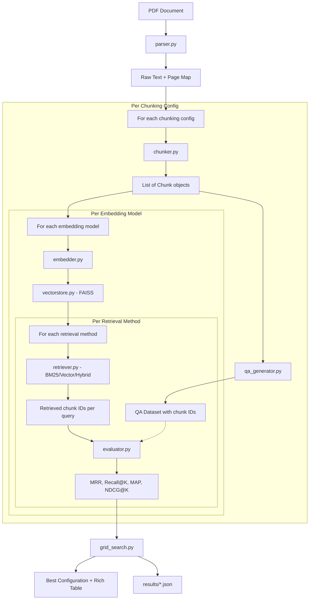

# RAG Evaluation Pipeline -- Mini-Project 03

## Overview

Build a modular RAG evaluation pipeline that ingests a PDF, chunks it with multiple strategies, embeds with multiple models, retrieves via BM25/vector/hybrid, generates per-config synthetic QA datasets, and runs a grid search across all combinations to find the optimal configuration by IR metrics.

## Directory Structure

```
mini-projects/03-rag-evaluation-pipeline/
├── run_pipeline.py            # CLI entrypoint (argparse)
├── requirements.txt           # Pinned dependencies
├── .env.example               # API key template
├── README.md
├── data/                      # PDF input + generated artifacts
│   └── pdf/                   # Place PDF here
├── cache/                     # Saved embeddings, QA datasets
├── results/                   # JSON experiment results
├── pipeline/
│   ├── __init__.py
│   ├── config.py              # Pydantic Settings + grid search config
│   ├── client.py              # OpenAI/OpenRouter client factory (follows 01 pattern)
│   ├── models.py              # All Pydantic models (Chunk, QAExample, ExperimentResult, etc.)
│   ├── parser.py              # PDF text extraction (pdfplumber primary, PyPDF2/PyMuPDF compare)
│   ├── chunker.py             # 3 strategies: fixed_size, sentence, semantic
│   ├── embedder.py            # Batch embedding + disk caching
│   ├── vectorstore.py         # FAISS index build/query/save/load
│   ├── retriever.py           # BM25, vector, hybrid (with score normalization)
│   ├── qa_generator.py        # Instructor-based synthetic QA per chunk config
│   ├── evaluator.py           # Recall@K, Precision@K, MRR, MAP, NDCG@K
│   └── grid_search.py         # Experiment orchestration + result aggregation
└── tests/
    ├── __init__.py
    ├── test_chunker.py
    ├── test_evaluator.py
    └── test_retriever.py
```

## Architecture Flow



## Key Design Decisions

### Fair Evaluation (Critical)

Each chunking configuration gets its **own** synthetic QA dataset. The QA generator receives the chunk list for a specific config and generates questions tied to those specific chunk IDs. This ensures apples-to-apples comparison.

### Client Pattern

Follow `mini-projects/01-synthetic-data-pipeline/pipeline/client.py` pattern: env var loading from multiple `.env` paths, `get_openai_client()`, `get_instructor_client()`. Add `get_embedding_client()` for LiteLLM or direct OpenAI embedding calls.

### Embedding Caching

Embeddings are expensive. Cache to `cache/{chunking_config_hash}_{model_name}.npz`. Check cache before computing. This allows re-running evaluation code without re-embedding.

### Score Normalization for Hybrid

BM25 scores are unbounded; vector cosine similarities are 0-1. Normalize both to [0,1] via min-max within each result set before combining with alpha weight: `score = alpha * vector_norm + (1 - alpha) * bm25_norm`.

### BM25 Deduplication

BM25 results are embedding-model-independent. The grid search will detect this and reuse BM25 results across embedding models for the same chunking config.

## Module Specifications

### `config.py`

- `PipelineSettings(BaseSettings)`: env vars for API keys, model names, paths
- `ChunkingConfig`: parser, method, chunk_size, overlap, sentences_per_chunk, max_tokens
- `GridSearchConfig`: list of chunking configs, embedding models, retrieval methods, k values
- Default grid: 4 chunking x 2 embedding x 3 retrieval = 24 experiments

### `models.py`

- `Chunk`: id (UUID), text, page_number, chunk_index, start_char, end_char, method, metadata
- `QAExample`: question, relevant_chunk_ids, metadata
- `RetrievalResult`: query, retrieved_chunk_ids, scores, method, time_taken
- `MetricsResult`: recall_at_k, precision_at_k, mrr, map_score, ndcg_at_k, total_queries, avg_retrieval_time
- `ExperimentResult`: experiment_id, embedding_model, chunking_method, retrieval_method, use_reranking, metrics

### `parser.py`

- `parse_pdf(path, parser="pdfplumber") -> list[PageText]`
- `extract_full_text(pages) -> str`
- Support pdfplumber (primary), PyPDF2, PyMuPDF as alternatives

### `chunker.py`

- `chunk_fixed_size(text, chunk_size, overlap, pages) -> list[Chunk]`
- `chunk_by_sentence(text, sentences_per_chunk, overlap_sentences, pages) -> list[Chunk]`
- `chunk_semantic(text, max_tokens, pages) -> list[Chunk]` -- uses spaCy for boundary detection
- `create_chunks(text, config: ChunkingConfig, pages) -> list[Chunk]` -- dispatcher

### `embedder.py`

- `embed_batch(texts, model, batch_size=100) -> np.ndarray` -- ThreadPoolExecutor for parallel batches
- `embed_chunks(chunks, model, cache_dir) -> np.ndarray` -- with disk caching via `.npz`
- Models: `text-embedding-3-small` (1536d), `text-embedding-3-large` (3072d)

### `vectorstore.py`

- `build_index(embeddings: np.ndarray) -> faiss.IndexFlatL2`
- `search_index(index, query_embedding, k) -> tuple[distances, indices]`
- `save_index(index, path)` / `load_index(path)`

### `retriever.py`

- `retrieve_bm25(query, chunks, k) -> RetrievalResult` -- rank_bm25
- `retrieve_vector(query, index, chunks, embed_model, k) -> RetrievalResult`
- `retrieve_hybrid(query, chunks, index, embed_model, k, alpha=0.5) -> RetrievalResult`
- Min-max normalization helper for hybrid score fusion

### `qa_generator.py`

- `generate_qa_dataset(chunks, num_questions=20, model="deepseek/deepseek-r1-0528:free") -> list[QAExample]`
- Uses Instructor for structured output (question + relevant_chunk_ids)
- Selects diverse chunks (spread across pages, varied content)
- Generates question types: factual, conceptual, analytical

### `evaluator.py`

- `recall_at_k(relevant, retrieved, k) -> float`
- `precision_at_k(relevant, retrieved, k) -> float`
- `mean_reciprocal_rank(relevant, retrieved) -> float`
- `mean_average_precision(relevant, retrieved) -> float`
- `ndcg_at_k(relevant, retrieved, k) -> float`
- `evaluate_retrieval(qa_dataset, retrieval_results, k_values=[1,3,5,10]) -> MetricsResult`

### `grid_search.py`

- `run_experiment(chunking_config, embedding_model, retrieval_method, chunks, qa_dataset, ...) -> ExperimentResult`
- `run_grid_search(config: GridSearchConfig, pdf_path) -> list[ExperimentResult]`
- `find_best_config(results, metric="mrr") -> ExperimentResult`
- `display_results_table(results)` -- Rich Table with all experiments sorted by MRR
- `save_results(results, path)` -- JSON with Pydantic validation

### `run_pipeline.py`

- `--mode full` -- run complete grid search
- `--mode parse-only` -- just parse and show PDF stats
- `--mode evaluate` -- re-run evaluation from cached data
- `--pdf PATH` -- path to PDF file
- `--num-questions N` -- QA questions per config (default 20)
- Rich console output with progress bars and final results table

## Dependencies (`requirements.txt`)

| Package | What it does in this project |
|---------|------------------------------|
| **openai** | Official Python SDK for the OpenAI API. Used for embedding calls (`text-embedding-3-small/large`) and as the transport layer for OpenRouter-compatible endpoints. |
| **instructor** | Wraps the OpenAI client so LLM calls return validated Pydantic models instead of raw text. Used in `qa_generator.py` to guarantee structured QA output with valid chunk IDs. |
| **pydantic** | Data validation and serialization. Every data model (`Chunk`, `QAExample`, `ExperimentResult`, etc.) uses it to enforce types and constraints at runtime. |
| **pydantic-settings** | Loads configuration from `.env` files into typed Python objects. `PipelineSettings` reads API keys and pipeline defaults this way. |
| **python-dotenv** | Reads `.env` files into `os.environ`. The low-level loader that `pydantic-settings` and `client.py` both rely on. |
| **pdfplumber** | PDF text extraction with layout awareness -- preserves tables, columns, and spatial positioning. The primary parser for this project. |
| **PyPDF2** | Simpler PDF text extraction. Used as a comparison parser to measure how extraction quality affects downstream retrieval metrics. |
| **PyMuPDF** | Fast C-based PDF extraction (imported as `fitz`). Third parser option; generally the fastest and handles scanned/complex PDFs well. |
| **faiss-cpu** | Facebook AI Similarity Search. Stores chunk embeddings as a vector index and performs fast nearest-neighbor lookup for vector retrieval. |
| **rank-bm25** | BM25 (Best Matching 25) implementation. Pure keyword/lexical retrieval with no embeddings needed. Serves as the baseline retrieval method. |
| **nltk** | Natural Language Toolkit. Used for sentence tokenization (`sent_tokenize`) in the sentence-based chunking strategy. |
| **spacy** | Industrial NLP library. Used for semantic chunking -- detects topic and paragraph boundaries via linguistic features (POS tags, dependency parse). |
| **litellm** | Unified API wrapper for 100+ LLM/embedding providers. Lets us swap between OpenAI and OpenRouter embedding endpoints with a single interface. |
| **rich** | Terminal formatting library. Produces the colored results tables, progress bars, and structured console output for the CLI. |
| **numpy** | Numeric array library. Embedding vectors are stored as numpy arrays; also needed for FAISS operations and score normalization math. |
| **cohere** | Cohere API client. Used specifically for the optional reranking step (cross-encoder re-scoring of top-K retrieval results). |
| **pytest** | Test runner. Executes `test_chunker.py`, `test_evaluator.py`, and `test_retriever.py`. |

## Testing Strategy

- **test_chunker.py**: Verify chunk boundaries, overlap, metadata, word-boundary awareness for fixed-size, sentence count for sentence-based
- **test_evaluator.py**: Known-answer tests for each metric (hand-computed expected values)
- **test_retriever.py**: Verify BM25 returns keyword matches, vector returns semantic matches, hybrid combines both

## Implementation Order

Phases are ordered to build the pipeline incrementally end-to-end:

1. **Scaffold**: project structure, requirements, config, models, client
2. **PDF Parse + Chunk**: parser.py, chunker.py (3 strategies), test_chunker.py
3. **Embed + Store**: embedder.py (batch + cache), vectorstore.py (FAISS)
4. **Retrieve**: retriever.py (BM25, vector, hybrid), test_retriever.py
5. **QA Generation**: qa_generator.py with Instructor structured output
6. **Evaluation Engine**: evaluator.py (all 5 metrics), test_evaluator.py
7. **Grid Search + CLI**: grid_search.py, run_pipeline.py, Rich output
8. **Cohere Reranking**: Add reranking comparison on best config
9. **Polish**: README, .env.example, final validation pass

## Optional Frontend (Decide After Core Pipeline Works)

Three options, in increasing order of effort:

### Option A: Streamlit Dashboard (~1 file, `dashboard.py`)

- Reads `results/*.json` and visualizes the grid search output
- Heatmap of MRR across chunking x embedding x retrieval
- Bar charts comparing metrics per configuration
- Filterable table of all experiments
- Add `streamlit>=1.35` to requirements
- Launch: `streamlit run dashboard.py`

### Option B: Gradio App with Query Playground (~1-2 files)

- Everything in Option A, plus an interactive query tab
- Pick a configuration, type a question, see retrieved chunks with scores and rank positions highlighted
- Useful for debugging why one config beats another
- Add `gradio>=4.30` to requirements
- Launch: `gradio app.py`

### Option C: FastAPI + React/Next.js (separate project scope)

- Full web service: upload PDF, configure grid, kick off experiments, stream results
- Would warrant its own `frontend/` directory and significant additional work
- Only worth considering if the pipeline becomes a reusable tool beyond this project
