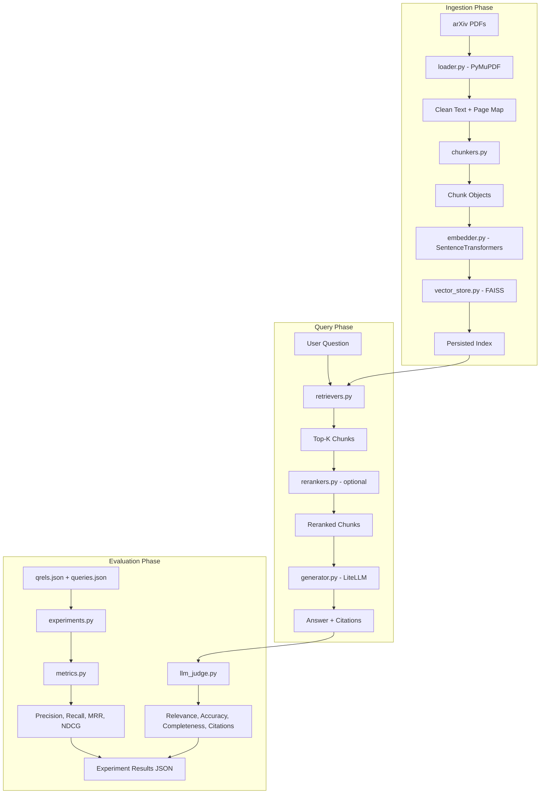

# RAG PDF QA System -- Mini-Project 04

## Overview

Build a modular RAG system over arXiv PDF papers using the Vectara Open RAG Benchmark (1,000 papers, 3,045 QA pairs with ground truth). The system supports swappable chunking strategies, embedding models, retrieval methods, and rerankers -- with rigorous IR evaluation, LLM-as-Judge scoring, CLI tools, and a Streamlit UI.

## Objectives and Success Criteria

- Ingest arXiv PDFs, chunk with 4 strategies, embed with 2 models, retrieve via dense/BM25/hybrid
- Evaluate retrieval using ground truth from `qrels.json` (Precision@5 > 0.60, Recall@5 > 0.80, MRR > 0.70, NDCG@5 > 0.75)
- Generate answers with citations; evaluate with LLM-as-Judge (avg > 4.0/5)
- Run 12+ experiment configurations with full metadata tracking
- Deliver CLI tools (ingest, query, evaluate) and Streamlit web UI
- All components swappable through abstract base classes and YAML configuration

## Relationship to Existing Work

- **Separate project** from `mini-projects/03-rag-evaluation-pipeline/` (which targets single-PDF synthetic QA with OpenAI embeddings)
- **Reuses patterns** from `mini-projects/01-synthetic-data-pipeline/pipeline/client.py` (env loading, client factory) and `models.py` (Pydantic v2 schemas)
- **Follows** the 6-step RAG debugging/eval process from `.cursor/lessons/13-ai-debugging-eval-centric-rag.md`

## Project Structure

```
mini-projects/04-rag-pdf-qasystem/
├── README.md
├── requirements.txt
├── .env.example
├── config/
│   ├── default.yaml              # Default pipeline settings
│   └── experiments/
│       └── baseline.yaml         # Experiment grid definition
├── data/                         # Dataset files (gitignored except READMEs)
│   ├── papers/                   # Downloaded arXiv PDFs
│   ├── corpus/                   # Pre-parsed fallback text (from HF)
│   ├── indices/                  # Persisted FAISS indices + metadata
│   ├── pdf_urls.json
│   ├── queries.json
│   ├── answers.json
│   └── qrels.json
├── experiments/
│   └── results/                  # Saved experiment JSONs
├── scripts/
│   ├── download_dataset.py       # Fetch HF dataset + arXiv PDFs
│   ├── ingest.py                 # CLI: PDF -> chunks -> index
│   ├── query.py                  # CLI: Interactive QA
│   └── evaluate.py               # CLI: Run experiment grid
├── app.py                        # Streamlit web UI
├── rag/
│   ├── __init__.py
│   ├── interfaces.py             # ABCs: BaseChunker, BaseEmbedder, etc.
│   ├── config.py                 # PipelineSettings (pydantic-settings) + YAML loader
│   ├── client.py                 # LLM client factory (LiteLLM/OpenAI)
│   ├── models.py                 # Pydantic: Document, Chunk, RetrievalResult, QAResponse, Citation, etc.
│   ├── loader.py                 # PDF loading (PyMuPDF) + text preprocessing
│   ├── chunkers.py               # 4 strategies: fixed, recursive, semantic, sliding
│   ├── embedder.py               # SentenceTransformers wrapper + disk caching
│   ├── vector_store.py           # FAISS IndexFlatIP + save/load
│   ├── retrievers.py             # Dense, BM25, Hybrid (with min-max normalization)
│   ├── rerankers.py              # Cohere API + cross-encoder
│   ├── generator.py              # LLM answer generation + prompt templates + citation extraction
│   ├── metrics.py                # Precision@K, Recall@K, MRR, NDCG@K
│   ├── llm_judge.py              # LLM-as-Judge (Instructor + Pydantic structured output)
│   └── experiments.py            # Experiment orchestration + result aggregation
└── tests/
    ├── conftest.py               # Shared fixtures (sample chunks, mock embeddings)
    ├── test_chunkers.py
    ├── test_metrics.py
    ├── test_retrievers.py
    └── test_citations.py
```

## Architecture Flow



## Key Design Decisions

### 1. Ground Truth Mapping (qrels -> chunks)

The `qrels.json` maps `query_id -> {paper_id: section_index}`. Our chunks have `document_id` (paper_id) and character offsets. The `corpus/{paper_id}.json` files contain section boundaries.

**Strategy:** During ingestion, load the corpus JSON for each paper to get section text boundaries. For each chunk, record which section(s) it overlaps with. During evaluation, a chunk is "relevant" to a query if its `document_id` matches the qrel paper_id AND it overlaps with the qrel section_index. This mapping is computed once at ingestion time and stored in chunk metadata.

### 2. Abstract Interfaces (`interfaces.py`)

All swappable components implement ABCs:

```python
class BaseChunker(ABC):
    @abstractmethod
    def chunk(self, document: Document) -> list[Chunk]: ...

class BaseEmbedder(ABC):
    @abstractmethod
    def embed(self, texts: list[str]) -> np.ndarray: ...

class BaseRetriever(ABC):
    @abstractmethod
    def retrieve(self, query: str, top_k: int) -> list[RetrievalResult]: ...

class BaseReranker(ABC):
    @abstractmethod
    def rerank(self, query: str, results: list[RetrievalResult], top_k: int) -> list[RetrievalResult]: ...
```

Factory functions in each module instantiate the right implementation from YAML config.

### 3. Embedding Caching

SentenceTransformers embeddings cached to `data/indices/{config_hash}_{model_name}.npz`. Check cache before computing. This prevents re-embedding when only the retrieval method changes.

### 4. Hybrid Score Fusion

Min-max normalize BM25 scores to [0,1], then combine: `score = alpha * dense_score + (1 - alpha) * bm25_score`. Experiment with alpha in {0.3, 0.5, 0.7}.

### 5. FAISS with L2-Normalized Embeddings

SentenceTransformers embeddings are L2-normalized, so `IndexFlatIP` (inner product) gives cosine similarity directly.

### 6. LLM-as-Judge with Structured Output

Follow the pattern from mini-project 01: use Instructor + Pydantic model for structured judge output (4 criteria, 1-5 scale each), `temperature=0`.

### 7. Development Subset

Start with 50 papers during development. Scale to full 1000 for final experiments. The `download_dataset.py` script accepts a `--limit` flag.

## Dependencies (`requirements.txt`)

```
pymupdf>=1.24
sentence-transformers>=3.0
faiss-cpu>=1.8
rank-bm25>=0.2
tiktoken>=0.7
litellm>=1.40
openai>=1.30
instructor>=1.3
pydantic>=2.7
pydantic-settings>=2.3
python-dotenv>=1.0
streamlit>=1.35
numpy>=1.26
cohere>=5.5
datasets>=2.19
requests>=2.31
pyyaml>=6.0
rich>=13.7
pytest>=8.0
ruff>=0.4
```

## Implementation Phases

### Phase 1: Scaffold + Data Setup
- Project structure, `requirements.txt`, `.env.example`, `.gitignore`
- `rag/models.py` -- all Pydantic data models (Document, Chunk, RetrievalResult, QAResponse, Citation, ExperimentResult)
- `rag/interfaces.py` -- all ABCs
- `rag/config.py` -- PipelineSettings + YAML config loader
- `rag/client.py` -- LLM client factory (follow 01 pattern)
- `config/default.yaml` + `config/experiments/baseline.yaml`
- `scripts/download_dataset.py` -- download HuggingFace dataset + arXiv PDFs (with `--limit`)
- Tests: `test_models.py` (validation tests for Pydantic schemas)

### Phase 2: Document Processing
- `rag/loader.py` -- PyMuPDF PDF loading, text cleaning, section-to-character-offset mapping from corpus JSON
- `rag/chunkers.py` -- 4 strategies:
  - `FixedSizeChunker` -- token-based with tiktoken, respect word boundaries
  - `RecursiveChunker` -- multi-separator splitting (paragraphs -> sentences -> words)
  - `SemanticChunker` -- embed sentences, find similarity breakpoints
  - `SlidingWindowChunker` -- overlapping fixed windows
- Each chunker tracks: document_id, page_number, start_char, end_char, chunk_index, section_indices
- Tests: `test_chunkers.py` (boundary handling, overlap, metadata, edge cases)

### Phase 3: Embedding + Vector Store
- `rag/embedder.py` -- SentenceTransformers wrapper, batch embedding, L2 normalization, `.npz` disk caching
- `rag/vector_store.py` -- FAISS IndexFlatIP, build from embeddings, search, save/load index + chunk metadata
- Tests: verify embedding dimensions, caching, search returns correct results

### Phase 4: Retrieval
- `rag/retrievers.py`:
  - `DenseRetriever` -- embed query, FAISS search
  - `BM25Retriever` -- rank_bm25 on chunk texts
  - `HybridRetriever` -- combine dense + BM25 with min-max normalization and alpha weighting
- Tests: `test_retrievers.py` (keyword matches for BM25, semantic matches for dense, hybrid combines both)

### Phase 5: Generation + Citations
- `rag/generator.py`:
  - Prompt templates with numbered context chunks
  - LLM answer generation via LiteLLM
  - Citation extraction (parse `[N]` references, map back to chunks)
- Tests: `test_citations.py` (regex extraction, mapping accuracy)

### Phase 6: Evaluation Engine
- `rag/metrics.py` -- Precision@K, Recall@K, MRR, NDCG@K (with known-answer unit tests)
- `rag/llm_judge.py` -- Instructor + Pydantic model for 4-criteria scoring (relevance, accuracy, completeness, citation quality)
- `rag/experiments.py` -- experiment orchestration: iterate configs, run retrieval, compute metrics, save results JSON
- Ground truth loading from `qrels.json` and chunk-section overlap matching
- Tests: `test_metrics.py` (hand-computed expected values)

### Phase 7: Reranking
- `rag/rerankers.py`:
  - `CohereReranker` -- API-based reranking
  - `CrossEncoderReranker` -- local cross-encoder model (e.g., `cross-encoder/ms-marco-MiniLM-L-6-v2`)
- Integrate into experiment pipeline as optional step

### Phase 8: CLI Tools + Streamlit UI
- `scripts/ingest.py` -- PDF directory -> chunked + indexed (configurable via YAML)
- `scripts/query.py` -- interactive QA loop with citation display
- `scripts/evaluate.py` -- run experiment grid from YAML config, output results JSON + Rich table
- `app.py` -- Streamlit: file upload, config sidebar (chunking/embedding/retrieval/top-k), question input, answer + citations display, source chunk viewer

### Phase 9: Experiments + Analysis + README
- Run 12+ configurations (3 chunking x 2 embeddings x 2 retrieval methods minimum)
- Add reranking experiments on top performers
- Generate comparison analysis (best chunking, hybrid vs dense, reranking cost/benefit, embedding quality/speed)
- Write README (summary, quickstart, prerequisites, architecture, evaluation results)
