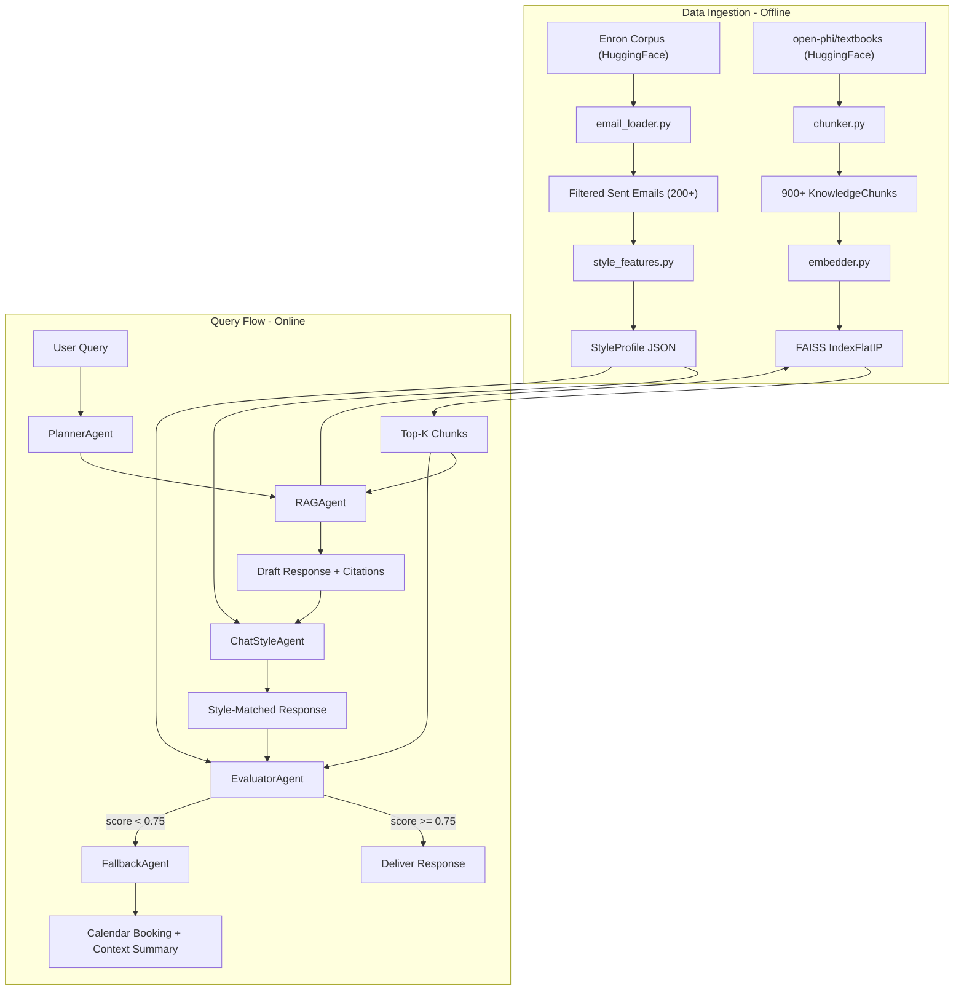

# Digital Clone Multi-Agent System

## Overview

Build a 5-agent digital clone system that learns an Enron employee's email style, retrieves knowledge via FAISS-backed RAG, evaluates response quality with multi-metric scoring, triggers calendar fallback on low confidence, and orchestrates everything through CrewAI.

## Directory Structure

```
mini-projects/06-digital-clone/
├── run_clone.py                # CLI entrypoint (argparse: --mode learn|query|demo|test-agents)
├── requirements.txt
├── .env.example
├── README.md
├── data/
│   ├── emails/                 # Cached processed Enron emails
│   ├── models/                 # style_profile_{employee}.json
│   ├── rag/                    # faiss_index/, chunks_metadata.json
│   ├── evaluations/            # Scored response logs
│   └── fallback_logs/          # Fallback trigger logs
├── core/                       # Pure computation -- no LLM calls, fully testable
│   ├── __init__.py
│   ├── models.py               # All Pydantic models (see below)
│   ├── client.py               # OpenAI client factory (follows 01 pattern)
│   ├── email_loader.py         # Enron HuggingFace loader + sent-mail filter
│   ├── style_features.py       # 11+ feature extraction, incremental learning
│   ├── embedder.py             # SentenceTransformers wrapper (all-MiniLM-L6-v2)
│   ├── chunker.py              # Text chunking (500 char, 50 overlap)
│   ├── vectorstore.py          # FAISS IndexFlatIP build/search/save/load
│   └── calendar.py             # Calendar link generation + slot formatting
├── agents/                     # CrewAI agent definitions + tools
│   ├── __init__.py
│   ├── style_agent.py          # ChatStyleAgent: learn style, score style match
│   ├── rag_agent.py            # RAGAgent: retrieve + generate cited response
│   ├── evaluator_agent.py      # EvaluatorAgent: multi-metric scoring + decision
│   ├── fallback_agent.py       # FallbackAgent: trigger detection + booking msg
│   └── planner.py              # PlannerAgent: CrewAI Crew orchestration
└── tests/
    ├── __init__.py
    ├── conftest.py             # Shared fixtures (sample emails, chunks, profiles)
    ├── test_models.py
    ├── test_email_loader.py
    ├── test_style_features.py
    ├── test_chunker.py
    ├── test_vectorstore.py
    ├── test_embedder.py
    ├── test_evaluator.py
    ├── test_fallback.py
    ├── test_calendar.py
    └── test_integration.py
```

## Architecture



## Key Design Decisions

### Two-Layer Architecture: `core/` vs `agents/`

- **`core/`**: Pure Python modules with no LLM calls. Handles email parsing, feature extraction, FAISS operations, chunking, embedding, scoring math. Fully unit-testable with no mocking needed for most tests.
- **`agents/`**: CrewAI agent definitions that wrap `core/` functions as tools. Agents use LLM reasoning for response generation, style application, and orchestration decisions.

This separation means the computational backbone can be tested independently from the LLM-dependent agent layer.

### CrewAI Integration

CrewAI agents are defined with roles, goals, and tools built from `core/` modules. The `PlannerAgent` creates a `Crew` with a sequential process that routes: RAG retrieval -> style application -> evaluation -> response/fallback.

Each agent exposes its `core/` functions as `@tool`-decorated callables so CrewAI can invoke them.

### Dataset Choices

- **Enron**: Use `enronarchive/mail` from HuggingFace (JSON format, cleaner than Kaggle raw text). Filter for `_sent_mail` or `Sent Items` folders. Target employee: pick one with 200+ sent emails (e.g., `jeff.dasovich`, `sara.shackleton`, or `vince.kaminski` -- verify counts at runtime).
- **Textbooks**: Use `open-phi/textbooks`, filter by `field == "computer science"` for a coherent knowledge base. Select entries until we exceed 900 chunks at 500 chars each.

### Style Feature Extraction (11 features)

All features are computed as floats or normalized vectors for embedding/similarity:

1. `avg_message_length` -- mean word count
2. `greeting_patterns` -- distribution dict of greetings (Hi, Dear, Hey, none)
3. `signoff_patterns` -- distribution dict of sign-offs (Thanks, Regards, Best, none)
4. `punctuation_patterns` -- frequency of `...`, `!!`, `--`, `;`
5. `capitalization_ratio` -- uppercase chars / total alpha chars
6. `question_frequency` -- questions per email (count of `?`)
7. `vocabulary_richness` -- unique words / total words (type-token ratio)
8. `common_phrases` -- top-10 bigrams/trigrams by frequency
9. `reasoning_patterns` -- frequency of logical connectors (because, therefore, however)
10. `sentiment_distribution` -- pos/neu/neg ratio via simple lexicon or TextBlob
11. `formality_level` -- formal vs informal word ratio
12. `technical_terminology_usage` -- ratio of domain-specific terms

Features are vectorized into a fixed-length numpy array for the style embedding.

### Incremental Learning

Weighted exponential moving average with configurable alpha (default 0.3):

```python
updated = (1 - alpha) * current + alpha * new_batch
```

Stored in `StyleProfile.style_embedding` and updated per batch without full recomputation.

### Evaluation Scoring

```
final_score = 0.4 * style_score + 0.4 * groundedness_score + 0.2 * confidence_score
```

- **style_score**: cosine similarity between response embedding and style profile embedding
- **groundedness_score**: overlap between response content and retrieved chunks (token-level or embedding similarity)
- **confidence_score**: retrieval relevance (avg chunk similarity) - uncertainty penalty (hedging phrase count)

Weights are configurable via `EvaluationConfig` Pydantic model, not hardcoded.

### Client Pattern

Follows `mini-projects/01-synthetic-data-pipeline/pipeline/client.py` -- multi-path `.env` loading, `get_openai_client()`, `get_model_name()`. Add `get_embedding_model()` returning the SentenceTransformers model instance.

## Pydantic Models (`core/models.py`)

```python
class EmailMessage(BaseModel):
    sender: str
    recipients: list[str]
    subject: str
    body: str
    timestamp: datetime
    folder: str

class StyleFeatures(BaseModel):
    avg_message_length: float
    greeting_patterns: dict[str, float]
    signoff_patterns: dict[str, float]
    punctuation_patterns: dict[str, float]
    capitalization_ratio: float
    question_frequency: float
    vocabulary_richness: float
    common_phrases: list[str]
    reasoning_patterns: dict[str, float]
    sentiment_distribution: dict[str, float]
    formality_level: float
    technical_terminology_usage: float

class StyleProfile(BaseModel):
    employee_name: str
    email_count: int
    style_features: StyleFeatures
    style_embedding: list[float]
    last_updated: datetime
    learning_alpha: float = 0.3

class KnowledgeChunk(BaseModel):
    chunk_id: str
    content: str
    source_topic: str
    source_field: str
    chunk_index: int
    embedding: list[float] | None = None

class EvaluationResult(BaseModel):
    style_score: float = Field(ge=0, le=1)
    groundedness_score: float = Field(ge=0, le=1)
    confidence_score: float = Field(ge=0, le=1)
    final_score: float = Field(ge=0, le=1)
    decision: Literal["deliver", "fallback"]
    reasoning: str

class FallbackResponse(BaseModel):
    trigger_reason: str
    context_summary: str
    calendar_link: str
    available_slots: list[str]

class QueryResult(BaseModel):
    query: str
    response: str | None
    evaluation: EvaluationResult
    fallback: FallbackResponse | None = None
    retrieved_chunks: list[str]
    processing_time_ms: float
```

## Implementation Phases

### Phase 1: Scaffold + Data Models + Core Utilities

- Project structure, `requirements.txt`, `.env.example`
- `core/models.py` with all Pydantic models
- `core/client.py` following existing pattern
- `core/embedder.py` wrapping SentenceTransformers
- `tests/test_models.py` for validation rules

### Phase 2: Email Loading + Style Learning

- `core/email_loader.py`: load from HuggingFace, filter sent mail, parse into `EmailMessage`
- `core/style_features.py`: extract 11+ features, vectorize, incremental update
- `agents/style_agent.py`: CrewAI agent wrapping style tools
- Tests: `test_email_loader.py`, `test_style_features.py`

### Phase 3: RAG Knowledge Base

- `core/chunker.py`: chunk textbook text (500 chars, 50 overlap)
- `core/vectorstore.py`: FAISS IndexFlatIP build, search, save, load
- `agents/rag_agent.py`: CrewAI agent for retrieval + LLM-generated response with citations
- Tests: `test_chunker.py`, `test_vectorstore.py`

### Phase 4: Evaluation + Fallback

- `agents/evaluator_agent.py`: style scoring, groundedness scoring, confidence scoring, weighted combination, threshold decision
- `core/calendar.py`: slot generation, link formatting
- `agents/fallback_agent.py`: trigger detection, context summarization, booking message
- Tests: `test_evaluator.py`, `test_fallback.py`, `test_calendar.py`

### Phase 5: Orchestration + CLI

- `agents/planner.py`: CrewAI Crew definition, sequential task pipeline, error handling
- `run_clone.py`: argparse CLI with modes (`learn`, `query`, `demo`, `test-agents`)
- `tests/test_integration.py`: end-to-end flow tests
- README.md with setup instructions and demo walkthrough

## Dependencies (`requirements.txt`)

```
crewai>=0.86
crewai-tools>=0.17
faiss-cpu>=1.9
sentence-transformers>=3.3
datasets>=3.2
pydantic>=2.7
numpy>=1.26
langchain-text-splitters>=0.3
openai>=1.30
python-dotenv>=1.0
textblob>=0.18
pytest>=8.0
logfire>=2.0
```

## Testing Strategy

- **Unit tests** (19+ in `core/`): models validation, email parsing, feature extraction math, chunking boundaries, FAISS operations, scoring formulas, calendar link generation
- **Agent tests** (4+ in `agents/`): mock LLM calls, verify tool routing, verify decision logic
- **Integration test** (1+): end-to-end query through all 5 agents with real or cached data
- Target: 23+ tests total, >90% coverage of `core/`

## Risk Mitigations

- **Enron dataset size**: The HuggingFace version is large. Cache processed emails to `data/emails/{employee}.json` after first load so subsequent runs are instant.
- **Embedding model download**: `all-MiniLM-L6-v2` is ~80MB. First run will download it; cache in default HuggingFace cache dir.
- **CrewAI LLM costs**: Use `gpt-4o-mini` (or equivalent via `OPENAI_BASE_URL`) for agent reasoning to keep costs low. Style feature extraction and scoring are local computation, no LLM needed.
- **FAISS on Apple Silicon**: `faiss-cpu` works on ARM64 Mac via pip. No special handling needed.
