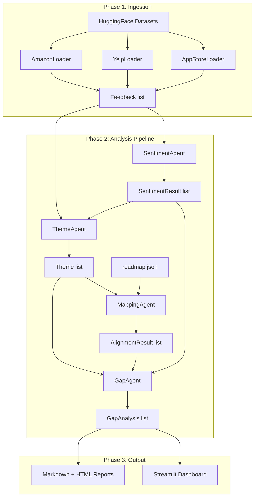

# Customer Feedback Multi-Agent System

## Project Location

`mini-projects/07-customer-feedback-agents/` -- completely standalone, no shared code with other projects. Follows established conventions from projects 01-03 (`run_pipeline.py` entrypoint, `pipeline/` package, `data/` output, `tests/`).

## Status

| Phase | Description | Status |
|-------|-------------|--------|
| 1 | Scaffold + Pydantic models + config + client + 3 source loaders + roadmap.json + tests | pending |
| 2 | SentimentAgent with structured output + evaluation vs star ratings + tests | pending |
| 3 | ThemeAgent with LLM clustering + tests | pending |
| 4 | embeddings.py + MappingAgent (cosine similarity + alignment) + tests | pending |
| 5 | GapAgent + priority scoring formula + LLM recommendations + tests | pending |
| 6 | Sequential orchestrator + CrewAI orchestration mode | pending |
| 7 | Markdown/HTML reports + Streamlit dashboard (4 tabs) + CLI polish | pending |

## Directory Structure

```
mini-projects/07-customer-feedback-agents/
├── run_pipeline.py              # CLI entrypoint (argparse)
├── run_dashboard.py             # Streamlit launcher
├── requirements.txt
├── .env.example
├── README.md
├── config.yaml                  # Thresholds, product areas, weights
├── roadmap.json                 # Sample roadmap items (8-12 items)
├── pipeline/
│   ├── __init__.py
│   ├── config.py                # pydantic-settings: env vars, thresholds, paths
│   ├── client.py                # OpenAI client factory (follows 01 pattern)
│   ├── models.py                # All Pydantic models (Feedback, SentimentResult, Theme, etc.)
│   ├── loaders/
│   │   ├── __init__.py          # Re-exports + load_all_sources()
│   │   ├── base.py              # BaseLoader ABC with normalize() contract
│   │   ├── amazon.py            # AmazonLoader -- streaming + .take(N)
│   │   ├── yelp.py              # YelpLoader -- label+1 for star rating
│   │   └── appstore.py          # AppStoreLoader -- review field, date parsing
│   ├── agents/
│   │   ├── __init__.py
│   │   ├── sentiment.py         # SentimentAgent -- LLM + structured output
│   │   ├── theme.py             # ThemeAgent -- LLM clustering
│   │   ├── mapping.py           # MappingAgent -- embeddings + cosine similarity
│   │   └── gap.py               # GapAgent -- priority scoring + LLM recommendations
│   ├── embeddings.py            # Batch embedding generation + L2 normalization + disk cache
│   ├── orchestrator.py          # Standard sequential pipeline (non-CrewAI)
│   ├── crew.py                  # CrewAI orchestration mode
│   ├── report.py                # Markdown + HTML report generation
│   └── evaluation.py            # Sentiment accuracy vs star ratings, theme coherence
├── dashboard/
│   ├── __init__.py
│   ├── app.py                   # Streamlit main (4 tabs)
│   ├── overview.py              # Sentiment pie, pain histogram, KPI cards
│   ├── themes.py                # Frequency bar chart, expandable theme details
│   ├── gaps.py                  # Priority matrix scatter, gap cards
│   └── explorer.py              # Filterable feedback table (source/sentiment/pain)
├── tests/
│   ├── __init__.py
│   ├── conftest.py              # Fixtures: sample feedback, roadmap items, mock LLM
│   ├── test_models.py           # Pydantic validation edge cases
│   ├── test_loaders.py          # Each loader normalizes correctly
│   ├── test_sentiment.py        # SentimentAgent with mocked LLM
│   ├── test_theme.py            # ThemeAgent output structure
│   ├── test_mapping.py          # Cosine similarity, threshold logic
│   ├── test_gap.py              # Priority score formula, edge cases
│   └── test_evaluation.py       # Accuracy calculation logic
├── data/                        # Pipeline output (gitignored)
└── visuals/                     # Generated charts (gitignored)
```

## Architecture Flow



## Key Design Decisions

### Data Loader Pattern

Each source gets a dedicated loader class inheriting from `BaseLoader(ABC)`:

```python
class BaseLoader(ABC):
    @abstractmethod
    def load_raw(self, sample_size: int) -> list[dict]: ...

    @abstractmethod
    def normalize(self, raw: dict) -> Feedback | None: ...

    def load(self, sample_size: int, min_length: int = 30) -> list[Feedback]:
        raw_items = self.load_raw(sample_size)
        results = []
        for item in raw_items:
            fb = self.normalize(item)
            if fb and len(fb.text) >= min_length:
                results.append(fb)
        return results
```

Source-specific normalization details:
- **AmazonLoader**: Streaming via `load_dataset(..., streaming=True)`, `.take(N * 2)` then random sample N for diversity. `rating` is float -> int. Concatenate `title + "\n" + text` for full review. Preserve `helpful_vote`, `verified_purchase`, `asin` in metadata.
- **YelpLoader**: `label + 1` for star rating (0-4 class index -> 1-5 stars). Only `text` field available. Minimal metadata.
- **AppStoreLoader**: Field is `review` not `text`, `star` for rating. Parse `date` string. Preserve `package_name` in metadata. Filter aggressively (many reviews under 30 chars).

### Agent Design

Each agent is a class with `analyze()` or `analyze_batch()` methods. Uses `instructor` for structured LLM output into Pydantic models. Configurable `model_name` and `temperature` per agent.

**SentimentAgent** processes feedback items individually (or in small batches). Key prompt challenge: scoring pain intensity *separately* from sentiment. Temperature 0.3 for consistency.

**ThemeAgent** receives all feedback + sentiment results in a single LLM call (or chunked if too many). Returns 5-10 themes with assigned feedback IDs. Temperature 0.5 for creativity in theme naming.

**MappingAgent** is non-LLM for the core similarity step: generates embeddings for theme descriptions and roadmap item descriptions via `text-embedding-3-small`, computes pairwise cosine similarity, applies configurable threshold (default 0.75). Uses LLM only for generating human-readable `alignment_reason` strings.

**GapAgent** computes priority scores via the weighted formula, then calls LLM to generate actionable recommendations for each gap. Temperature 0.7 for creative recommendations.

### Embedding Strategy

`embeddings.py` handles:
- Batch API calls to `text-embedding-3-small` (max 2048 texts per call)
- L2 normalization so `np.dot(a, b)` equals cosine similarity
- Disk cache at `data/embeddings_{hash}.npz` keyed by content hash
- Cosine similarity matrix via `np.dot(theme_embeddings, roadmap_embeddings.T)`

### CrewAI Orchestration

`crew.py` defines 5-6 CrewAI agents with roles/goals/backstories and wires them into `Crew(process=Process.sequential)`. The CrewAI agents wrap the core agent classes -- they don't duplicate logic. This is an alternative execution mode triggered by `--crew` flag.

### Configuration (`config.yaml`)

```yaml
sample_size: 3000
min_review_length: 30
similarity_threshold: 0.75
gap_priority_threshold: 0.6
max_themes: 10
model_name: gpt-4o-mini
embedding_model: text-embedding-3-small
priority_weights:
  pain: 0.35
  frequency: 0.25
  coverage: 0.25
  sentiment: 0.15
product_areas:
  - performance
  - usability
  - reliability
  - customer_support
  - pricing
  - features
```

### Sample Roadmap (`roadmap.json`)

Define 8-12 items spanning the product areas that reviews naturally cover. Examples:
- "Improve app load time and reduce crashes" (performance, high)
- "Redesign checkout flow for mobile users" (usability, medium)
- "Expand return/refund policy transparency" (customer_support, planned)
- "Add real-time order tracking notifications" (features, in_progress)

These are crafted *after* a preliminary scan of themes from the review data, to ensure some align and some don't (testing gap detection).

### CLI Interface

```
python run_pipeline.py --mode full [--sample-size 3000] [--source all|amazon|yelp|app_store]
python run_pipeline.py --mode full --crew    # CrewAI orchestration
python run_pipeline.py --mode full -r custom_roadmap.json
python run_pipeline.py --mode full --no-visuals
python run_pipeline.py --mode ingest-only    # Just load + normalize
python run_pipeline.py --mode sentiment-only # Ingest + sentiment
```

### Streamlit Dashboard

`run_dashboard.py` loads pipeline output from `data/` and renders 4 tabs:
- **Overview**: KPI cards (total feedback, avg pain, theme count, gap count), sentiment pie chart (Plotly), pain intensity histogram
- **Themes**: Horizontal bar chart of theme frequency, expandable cards with keywords/description/avg pain/coverage status
- **Gaps**: Scatter plot (x=feedback count, y=avg pain, size=priority score, color=has coverage), gap detail cards with recommendations
- **Explorer**: `st.dataframe` with column filters for source, sentiment, pain range, product area

### Evaluation Strategy

`evaluation.py` implements:
- **Sentiment accuracy vs stars**: Map star ratings to expected sentiment (1-2 = negative, 3 = neutral, 4-5 = positive), compare with LLM predictions. Report accuracy per source and overall.
- **Pain calibration**: Pearson correlation between pain scores and inverted star ratings (low stars = high pain expected).
- **Theme coherence**: For each theme, compute pairwise embedding similarity of assigned feedback; report average intra-theme similarity.

## Dependencies (`requirements.txt`)

```
openai>=1.30
instructor>=1.3
pydantic>=2.7
pydantic-settings>=2.3
python-dotenv>=1.0
datasets>=2.19
pandas>=2.2
numpy>=1.26
plotly>=5.22
streamlit>=1.35
crewai>=0.28
crewai-tools>=0.4
pyyaml>=6.0
jinja2>=3.1
pytest>=8.2
```

## Implementation Phases

### Phase 1: Scaffold + Data Models + Config + Client + Loaders

Foundation layer. All Pydantic models from the spec (`Feedback`, `SentimentResult`, `Theme`, `RoadmapItem`, `AlignmentResult`, `GapAnalysis`). Config via `pydantic-settings`. Client factory following project-01 pattern. Three source-specific loaders with `BaseLoader` ABC. Sample `roadmap.json` with 8-12 items.

**Tests**: `test_models.py` (validation rules, edge cases), `test_loaders.py` (each loader normalizes correctly, filters short reviews, handles schema quirks).

### Phase 2: SentimentAgent + Evaluation

`SentimentAgent` with structured output via `instructor`. Prompt that separately scores sentiment and pain intensity. Batch processing with rate-limit-aware retries. `evaluation.py` comparing predictions against star ratings across all 3 sources.

**Tests**: `test_sentiment.py` (mocked LLM responses, output validation), `test_evaluation.py` (accuracy calculation, pain calibration).

### Phase 3: ThemeAgent

LLM-based theme extraction. Feed summarized feedback (grouped pain points, key phrases) to LLM. Output: 5-10 themes with names, descriptions, keywords, assigned feedback IDs. Handle context window limits by summarizing before sending.

**Tests**: `test_theme.py` (output structure, coverage check, theme count within bounds).

### Phase 4: Embeddings + MappingAgent

`embeddings.py` for batch embedding with caching. `MappingAgent` computing cosine similarity matrix between theme and roadmap embeddings. Threshold-based alignment detection. LLM generates alignment reason strings for matched pairs.

**Tests**: `test_mapping.py` (cosine similarity math, threshold logic, alignment detection).

### Phase 5: GapAgent + Priority Scoring

Priority score formula implementation with configurable weights. LLM-generated recommendations for each gap. Sorting by priority score.

**Tests**: `test_gap.py` (formula correctness, edge cases -- zero feedback, all covered, all gaps).

### Phase 6: Orchestrator + CrewAI Mode

`orchestrator.py` wiring all agents sequentially with intermediate result serialization to `data/`. `crew.py` wrapping agents in CrewAI roles/tasks. Both modes produce identical output formats.

### Phase 7: Reports + Dashboard + CLI Polish

`report.py` generating Markdown and HTML (via Jinja2 templates) with executive summary, theme table, gap analysis, recommendations. Streamlit dashboard with 4 tabs loading from `data/` output files. CLI with all flags (`--mode`, `--sample-size`, `--source`, `--crew`, `-r`, `--no-visuals`).
