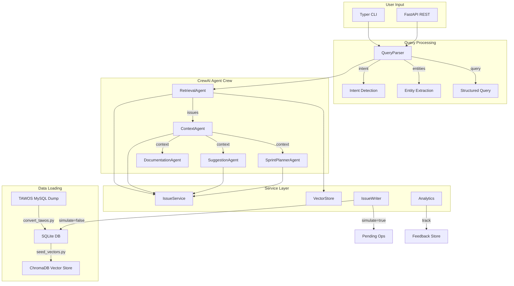

# AI-Powered Jira Copilot -- Implementation Plan

## Project Location

`mini-projects/08-jira-copilot/` -- completely standalone, no shared code with other projects. Follows the established mini-project pattern from `mini-projects/01-synthetic-data-pipeline/` and `mini-projects/02-resume-job-pipeline/`.

## Status

| Phase | Description | Status |
|-------|-------------|--------|
| 1 | Foundation -- Config, DB models (SQLAlchemy ORM for TAWOS schema), IssueService, convert_tawos.py | pending |
| 2 | ChromaDB vector store, BM25 keyword search, hybrid search with score fusion, seed_vectors.py | pending |
| 3 | LLM-backed query parser -- intent detection, entity extraction (regex + LLM), few-shot prompt | pending |
| 4 | 5 CrewAI agents (Retrieval, Context, Suggestion, SprintPlanner, Documentation), crew orchestration | pending |
| 5 | IssueWriter with simulation mode, pending_operations table, execute/discard workflow, bulk ops | pending |
| 6 | Analytics service -- suggestion logging, feedback recording, acceptance rates, quality metrics | pending |
| 7 | FastAPI with 30+ endpoints across 8 routers (core, issues, context, suggestions, sprint, write, analytics, docs) | pending |
| 8 | Typer CLI -- sync, search, query, context, suggest, plan-sprint, velocity, release-notes, chat, stats | pending |
| 9 | Evaluation suite -- retrieval accuracy (Recall@5, hybrid vs semantic), suggestion quality, sprint planning | pending |
| 10 | README, .env.example, ruff/pytest quality gates, demo video script, final cleanup | pending |

## Key Architectural Decisions

- **SQLite over MySQL** for portability. Provide a `scripts/convert_tawos.py` that loads the MySQL dump and exports to SQLite. Development starts with 1-2 TAWOS projects (~10-20K issues), scaling to full dataset later.
- **ChromaDB** (persistent, file-based) for vector store. Embeddings via `text-embedding-3-small`.
- **CrewAI** for multi-agent orchestration (5 agents, sequential process).
- **FastAPI** for REST API, **Typer** for CLI. Both call the same service layer.
- **Pydantic v2** everywhere (models, API schemas, config via `pydantic-settings`).
- **Simulation-first writes** -- all write ops are dry-run by default, stored in a pending operations table.
- **Hybrid search** -- `combined = 0.7 * semantic + 0.3 * keyword` with metadata filtering.

## Directory Structure

```
mini-projects/08-jira-copilot/
  README.md
  requirements.txt
  .env.example
  run_cli.py                    # Typer CLI entrypoint
  run_api.py                    # FastAPI uvicorn launcher
  scripts/
    convert_tawos.py            # MySQL dump -> SQLite converter
    seed_vectors.py             # Batch-embed issues into ChromaDB
  jira_copilot/
    __init__.py
    config.py                   # pydantic-settings: env vars, DB paths, model names
    db/
      __init__.py
      engine.py                 # SQLAlchemy engine + session factory
      models.py                 # ORM models (Issue, User, Sprint, Comment, ChangeLog, IssueLink, Component, etc.)
    services/
      __init__.py
      issue_service.py          # Data access: get_issue, search, get_links, get_velocity, etc.
      vector_store.py           # ChromaDB: index, semantic_search, hybrid_search
      query_parser.py           # NL -> intent + entities + structured query (LLM-backed)
      issue_writer.py           # Write ops with simulation mode, pending ops store
      analytics.py              # Suggestion tracking, feedback, acceptance rates
    agents/
      __init__.py
      tools.py                  # CrewAI tool wrappers around services
      retrieval_agent.py        # RAG-based issue search
      context_agent.py          # Linked issues, components, dev info assembly
      suggestion_agent.py       # 5 suggestion types with confidence scores
      sprint_planner_agent.py   # Capacity, velocity, health, recommendations
      documentation_agent.py    # Release notes generation
      crew.py                   # CrewAI Crew orchestration
    schemas/
      __init__.py
      requests.py               # Pydantic request models (QueryRequest, SuggestRequest, etc.)
      responses.py              # Pydantic response models (SearchResult, Suggestion, SprintPlan, etc.)
      domain.py                 # Domain models (VelocityData, WriteOperation, Feedback, etc.)
    api/
      __init__.py
      app.py                    # FastAPI app factory, middleware, CORS
      routers/
        __init__.py
        core.py                 # /chat, /query, /search
        suggestions.py          # /suggest, /suggest/{type}
        sprint.py               # /sprint/plan, /sprint/velocity, /sprint/health
        context.py              # /context/{issue_key}
        write.py                # /write/update, /write/pending, /write/execute
        analytics.py            # /analytics/acceptance, /analytics/suggestions
        issues.py               # /issues/{key}, /issues/search
        docs.py                 # /docs/release-notes
    cli/
      __init__.py
      commands.py               # Typer commands: sync, search, query, suggest, plan-sprint, etc.
  tests/
    __init__.py
    conftest.py                 # Fixtures: in-memory SQLite, sample issues, mock LLM
    test_issue_service.py
    test_vector_store.py
    test_query_parser.py
    test_issue_writer.py
    test_hybrid_search.py
    test_agents.py
    test_api.py
    test_cli.py
  data/                         # gitignored: SQLite DB, ChromaDB persist dir
  eval/
    test_queries.json           # Retrieval accuracy test set
    eval_retrieval.py           # Recall@5, Precision@5, MRR
    eval_suggestions.py         # LLM-as-judge for suggestion quality
```

## Data Flow



## Dependencies (`requirements.txt`)

```
openai
chromadb
crewai
crewai-tools
sqlalchemy
fastapi
uvicorn[standard]
typer[all]
pydantic>=2.0
pydantic-settings
python-dotenv
rank-bm25
numpy
```

## `.env.example`

```
OPENAI_API_KEY=sk-...
OPENAI_BASE_URL=              # optional, for OpenRouter/proxies
MODEL_NAME=gpt-4o             # LLM for agents
EMBEDDING_MODEL=text-embedding-3-small
DATABASE_URL=sqlite:///data/tawos.db
CHROMADB_PATH=data/chromadb
TAWOS_PROJECTS=APACHE,SPRING  # comma-sep project keys for dev subset
LOG_LEVEL=INFO
```

---

## Phase 1: Foundation -- Data Layer and Config (Day 1)

**Goal:** Load TAWOS data into SQLite, build the `IssueService` data access layer.

**Files:**
- `jira_copilot/config.py` -- `pydantic-settings` for all env vars with defaults
- `jira_copilot/db/engine.py` -- SQLAlchemy engine, `get_session` context manager
- `jira_copilot/db/models.py` -- ORM models mirroring TAWOS schema: `Issue`, `User`, `Sprint`, `Comment`, `ChangeLog`, `IssueLink`, `Component`, `IssueComponent`, `Project`, `Repository`, `Version`, `AffectedVersion`, `FixVersion`
- `jira_copilot/services/issue_service.py` -- `get_issue(key)`, `search_issues(filters)`, `get_linked_issues(key)`, `get_issue_comments(key)`, `get_sprint_issues(sprint_id)`, `get_project_velocity(project_key, n_sprints)`, `get_project_components(project_key)`
- `scripts/convert_tawos.py` -- Parse MySQL dump, create SQLite DB, insert data. Supports `--projects` flag for subset loading.
- `tests/conftest.py` -- In-memory SQLite with sample data fixtures
- `tests/test_issue_service.py`

**Key pattern from existing code:** Follow the `pipeline/client.py` pattern for env loading (search multiple `.env` paths). Use Pydantic `BaseSettings` for typed config.

---

## Phase 2: Vector Store and Hybrid Search (Day 2)

**Goal:** Index issues in ChromaDB, implement hybrid search with BM25 + semantic fusion.

**Files:**
- `jira_copilot/services/vector_store.py`:
  - `index_issues(issues)` -- create embeddings from `f"{key} {title} {description_text}"`, store with metadata (`type`, `status`, `priority`, `project`, `sprint_id`, `assignee_id`, `components`)
  - `semantic_search(query, filters, limit)` -- ChromaDB cosine similarity
  - `keyword_search(query, filters, limit)` -- BM25 over indexed content using `rank-bm25`
  - `hybrid_search(query, filters, limit, alpha=0.7)` -- score fusion: `alpha * semantic + (1-alpha) * keyword`, deduplicate, re-rank
- `scripts/seed_vectors.py` -- Batch process: load issues from SQLite, generate embeddings, upsert into ChromaDB. Progress bar via tqdm. Supports `--project` and `--batch-size` flags.
- `tests/test_vector_store.py` -- Test semantic, keyword, and hybrid search accuracy
- `tests/test_hybrid_search.py` -- Compare hybrid vs semantic-only on sample queries

**Document construction for embedding:**
```python
content = f"{issue.issue_key} {issue.title}"
if issue.description_text:
    content += f" {issue.description_text[:2000]}"
```

Metadata stored alongside each document enables filtered search (e.g., "open bugs in component X").

---

## Phase 3: Query Parser (Day 3)

**Goal:** Parse natural language queries into intent + entities + structured operations.

**Files:**
- `jira_copilot/services/query_parser.py`:
  - `parse_query(text) -> ParsedQuery` -- LLM-backed with few-shot examples
  - `ParsedQuery`: intent (`search`, `suggest`, `plan_sprint`, `write`, `analyze`, `chat`), entities (issue_keys, project_names, statuses, priorities, assignees, date_ranges), raw_query, structured_filters
  - Regex pre-extraction for issue keys (`[A-Z]+-\d+`), then LLM for intent + remaining entities
  - Few-shot prompt with ~10 example queries covering all intents
- `jira_copilot/schemas/domain.py` -- `ParsedQuery`, `QueryIntent` enum, `ExtractedEntities`
- `tests/test_query_parser.py` -- Test intent detection accuracy, entity extraction

---

## Phase 4: CrewAI Agents (Days 3-5)

**Goal:** Implement 5 specialized agents, wire them with CrewAI.

### Agent Tools (`jira_copilot/agents/tools.py`)
CrewAI `@tool` wrappers around service methods: `search_issues_tool`, `get_issue_context_tool`, `get_velocity_tool`, `get_sprint_issues_tool`, `get_components_tool`, `get_linked_issues_tool`

### Retrieval Agent (`retrieval_agent.py`)
- Role: "Issue Retrieval Specialist"
- Tools: `hybrid_search`, `search_issues`
- Takes parsed query, returns ranked issue list with relevance scores

### Context Agent (`context_agent.py`)
- Role: "Context Assembly Expert"
- Tools: `get_linked_issues`, `get_issue_comments`, `get_components`
- Takes issue key(s), assembles full context: linked issues (with type/direction), components, recent comments, change history, PR URLs

### Suggestion Agent (`suggestion_agent.py`)
- Role: "Issue Quality Advisor"
- 5 suggestion types, each with confidence score:
  1. **Summary improvement** -- LLM rewrites title for clarity/actionability
  2. **Component recommendation** -- find similar issues, extract their components, suggest
  3. **Priority analysis** -- urgency keywords + impact indicators + linked context
  4. **Story point estimation** -- weighted average of similar issues' story points
  5. **Assignee suggestion** -- past work patterns on similar issues/components

### Sprint Planner Agent (`sprint_planner_agent.py`)
- Role: "Sprint Planning Strategist"
- Capacity: `team_size * points_per_person * availability`
- Velocity: average completed points over last N sprints from TAWOS data
- Health: % blocked issues, % unestimated, assignee load distribution
- Recommendations: prioritized issue list fitting capacity, respecting dependencies

### Documentation Agent (`documentation_agent.py`)
- Role: "Technical Writer"
- Generates release notes from completed issues in a sprint/version
- Groups by type (features, bugs, improvements), includes linked PRs

### Crew Orchestration (`crew.py`)
- `JiraCopilotCrew` class:
  - `search(query)` -- RetrievalAgent only
  - `get_context(issue_key)` -- ContextAgent
  - `suggest(issue_key, types)` -- RetrievalAgent -> ContextAgent -> SuggestionAgent
  - `plan_sprint(project_key, params)` -- SprintPlannerAgent
  - `generate_release_notes(sprint_id)` -- DocumentationAgent
  - `chat(message)` -- QueryParser -> route to appropriate crew pipeline

**Tests:** `tests/test_agents.py` -- Mock LLM responses, test tool invocation and output structure.

---

## Phase 5: Write Operations and Simulation (Day 5-6)

**Goal:** Safe write operations with simulation-first workflow.

**Files:**
- `jira_copilot/services/issue_writer.py`:
  - `WriteOperation` stored in SQLite table (`pending_operations`)
  - `simulate_update(issue_key, field, new_value) -> WriteOperation` -- logs intent, does NOT modify issue
  - `get_pending() -> list[WriteOperation]` -- review queue
  - `execute_pending(operation_ids)` -- apply changes to SQLite DB
  - `discard_pending(operation_ids)` -- remove from queue
  - Supports: update title, description, priority, assignee, components, sprint assignment, status transition
  - Bulk operations: apply suggestion set, move multiple issues to sprint
- `jira_copilot/schemas/domain.py` -- `WriteOperation`, `OperationType` enum
- `tests/test_issue_writer.py` -- Verify simulation creates pending ops without DB mutation, execute applies them

---

## Phase 6: Analytics and Feedback (Day 6)

**Goal:** Track suggestions and acceptance for continuous improvement.

**Files:**
- `jira_copilot/services/analytics.py`:
  - SQLite tables: `suggestions` (id, type, issue_key, original, suggested, confidence, timestamp), `feedback` (suggestion_id, accepted, modified, reason, timestamp)
  - `log_suggestion(suggestion) -> id`
  - `record_feedback(suggestion_id, accepted, reason)`
  - `get_acceptance_rates(by_type=True) -> dict`
  - `get_suggestion_history(issue_key=None, type=None)`
  - `get_quality_metrics()` -- overall stats

---

## Phase 7: FastAPI (30+ Endpoints) (Day 7)

**Goal:** REST API with automatic OpenAPI docs, organized by feature.

**Routers and endpoints:**

- **Core** (`api/routers/core.py`): `POST /chat`, `POST /query`, `POST /search`, `GET /health`
- **Issues** (`api/routers/issues.py`): `GET /issues/{key}`, `GET /issues/search`, `GET /issues/{key}/comments`, `GET /issues/{key}/links`, `GET /issues/{key}/changes`
- **Context** (`api/routers/context.py`): `GET /context/{key}`, `GET /context/{key}/deep`
- **Suggestions** (`api/routers/suggestions.py`): `POST /suggest/{key}`, `POST /suggest/{key}/summary`, `POST /suggest/{key}/components`, `POST /suggest/{key}/priority`, `POST /suggest/{key}/estimate`, `POST /suggest/{key}/assignee`
- **Sprint** (`api/routers/sprint.py`): `POST /sprint/plan`, `GET /sprint/{id}/health`, `GET /sprint/{id}/issues`, `GET /velocity/{project_key}`, `GET /sprint/{id}/recommendations`
- **Write** (`api/routers/write.py`): `POST /write/update`, `POST /write/bulk`, `GET /write/pending`, `POST /write/execute`, `POST /write/discard`
- **Analytics** (`api/routers/analytics.py`): `GET /analytics/acceptance`, `GET /analytics/suggestions`, `POST /analytics/feedback`, `GET /analytics/metrics`
- **Documentation** (`api/routers/docs.py`): `POST /docs/release-notes`, `POST /docs/sprint-summary`

All endpoints use Pydantic request/response models from `jira_copilot/schemas/`.

---

## Phase 8: Typer CLI (Day 7-8)

**Goal:** CLI interface for all major features.

**File:** `jira_copilot/cli/commands.py` + `run_cli.py`

**Commands:**
- `sync` -- load/refresh TAWOS data, rebuild vector index
- `search <query>` -- hybrid search with formatted output
- `query <natural language>` -- parsed NL query
- `context <issue_key>` -- deep context assembly
- `suggest <issue_key> [--type summary|components|priority|estimate|assignee|all]`
- `plan-sprint <project_key> [--capacity N] [--sprints N]`
- `velocity <project_key> [--sprints N]`
- `release-notes <sprint_id>`
- `chat` -- interactive conversational mode
- `stats` -- analytics summary
- `pending` -- view pending write operations
- `execute <op_id>` -- apply a pending write

---

## Phase 9: Evaluation (Day 8-9)

**Goal:** Measure system quality against success metrics.

**Files:**
- `eval/test_queries.json` -- 50+ test queries with known relevant issue keys (manually curated from TAWOS subset)
- `eval/eval_retrieval.py`:
  - Recall@5, Precision@5, MRR for semantic-only vs hybrid
  - Target: Recall@5 > 0.80, hybrid improves recall by >15% over semantic-only
- `eval/eval_suggestions.py`:
  - LLM-as-judge scoring for summary improvements (clarity, actionability, conciseness)
  - Component precision (% appropriate)
  - Story point MAE vs actuals
  - Priority agreement rate
  - Assignee match rate
- Sprint planning validation: compare AI recommendations against actual sprint data from TAWOS

---

## Phase 10: Polish and Documentation (Day 9)

**Goal:** README, demo prep, final quality pass.

- `README.md` with: project summary, architecture diagram, quickstart, prerequisites, evaluation instructions, demo script
- Ensure all quality gates pass: `ruff check`, `ruff format`, `pytest`
- Clean up logging (structured, no print statements)
- Verify `.env.example` is complete
- Record demo video script (90-180s)

---

## Risk Mitigations

- **TAWOS size**: Start with `--projects APACHE` subset (~20K issues). `seed_vectors.py` supports incremental indexing.
- **Embedding cost**: `text-embedding-3-small` is ~$0.02/1M tokens. 20K issues ~= 10M tokens = ~$0.20. Full 458K is ~$4.
- **CrewAI complexity**: Start each agent with a simple single-prompt implementation. Iterate prompts based on eval results.
- **MySQL dump parsing**: If the `.sql` dump is too complex to parse directly, fall back to loading into MySQL first, then `mysqldump --tab` to CSV, then CSV -> SQLite.
- **API key availability**: The repo pattern uses `OPENAI_API_KEY` in `.env`. Same pattern here.
