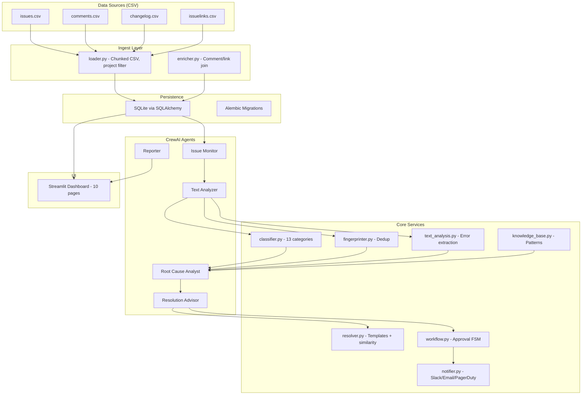

# AI-Powered Issue Triage Assistant -- Implementation Plan

## Project Location

`mini-projects/09-issue-triage-assistant/` -- completely standalone, no shared code with other projects.

## Status

| Phase | Description | Status |
|-------|-------------|--------|
| 1 | Scaffold + DB -- project structure, config, SQLAlchemy ORM (10 tables), Alembic setup, Pydantic models | pending |
| 2 | Data Ingestion -- chunked CSV loading (issues, comments, changelog, links), project filtering, enrichment | pending |
| 3 | Core Services -- classifier (13 categories), text_analysis (error/stack trace extraction), fingerprinter (dedup) | pending |
| 4 | LLM Client (Groq) + Knowledge Base (CRUD, pattern search, learn_from_resolved) | pending |
| 5 | Multi-Agent System -- 5 CrewAI agents with tools, TriageCrew orchestrator | pending |
| 6 | Resolution System -- similar issue retrieval, templates, approval workflow FSM | pending |
| 7 | Notifications -- alert rules, Slack/Email/PagerDuty dispatch, cooldowns | pending |
| 8 | Streamlit Dashboard -- Home + 9 pages, all wired to SQLite | pending |
| 9 | Evaluation + Polish -- LLM-as-judge, metrics, README, end-to-end verification | pending |

## Directory Structure

```
mini-projects/09-issue-triage-assistant/
├── PLAN.md
├── README.md
├── requirements.txt
├── .env.example
├── alembic.ini
├── run_pipeline.py                   # CLI entrypoint (argparse --mode)
├── pipeline/
│   ├── __init__.py
│   ├── config.py                     # Pydantic Settings, taxonomy constants, templates
│   ├── client.py                     # Groq/OpenAI-compatible client factory
│   ├── models.py                     # Pydantic request/response models (non-ORM)
│   ├── db/
│   │   ├── __init__.py
│   │   ├── engine.py                 # SQLAlchemy engine + session factory
│   │   └── tables.py                 # ORM models (8+ tables)
│   ├── ingest/
│   │   ├── __init__.py
│   │   ├── loader.py                 # Chunked CSV loading + project filtering
│   │   └── enricher.py              # Comment/changelog/link enrichment
│   ├── services/
│   │   ├── __init__.py
│   │   ├── classifier.py            # 13-category taxonomy classifier
│   │   ├── fingerprinter.py         # Signature hashing, duplicate detection
│   │   ├── text_analysis.py         # Error/stack trace extraction, pattern profiling
│   │   ├── knowledge_base.py        # KB CRUD + pattern search
│   │   ├── resolver.py              # Resolution templates + similar issue retrieval
│   │   ├── workflow.py              # Approval workflow state machine
│   │   └── notifier.py             # Multi-channel notification manager
│   ├── agents/
│   │   ├── __init__.py
│   │   ├── crew.py                  # TriageCrew orchestrator (CrewAI)
│   │   ├── issue_monitor.py         # Issue Monitor Agent + tools
│   │   ├── text_analyzer.py         # Text Analyzer Agent + tools
│   │   ├── root_cause.py           # Root Cause Analyst Agent + tools
│   │   ├── resolution_advisor.py   # Resolution Advisor Agent + tools
│   │   └── reporter.py            # Reporting Agent + tools
│   └── evaluation/
│       ├── __init__.py
│       ├── judge.py                 # LLM-as-Judge for root cause quality
│       └── metrics.py              # Classification accuracy, resolution relevance
├── dashboard/
│   ├── app.py                       # Streamlit main (Home page)
│   └── pages/
│       ├── 01_project_status.py
│       ├── 02_text_analysis.py
│       ├── 03_incidents.py
│       ├── 04_reports.py
│       ├── 05_resolutions.py
│       ├── 06_classification.py
│       ├── 07_projects.py
│       ├── 08_issue_links.py
│       └── 09_metrics.py
├── migrations/
│   ├── env.py                       # Alembic env
│   └── versions/                    # Migration scripts
├── tests/
│   ├── __init__.py
│   ├── conftest.py                  # Fixtures: in-memory DB, sample issues
│   ├── test_loader.py
│   ├── test_classifier.py
│   ├── test_fingerprinter.py
│   ├── test_text_analysis.py
│   ├── test_workflow.py
│   ├── test_resolver.py
│   └── test_knowledge_base.py
├── data/                            # Downloaded CSV files (gitignored)
└── visuals/                         # Generated charts (gitignored)
```

## Architecture



## Key Design Decisions

### LLM Client -- Groq via OpenAI-Compatible API

Follow `01-synthetic-data-pipeline/pipeline/client.py` pattern. Groq exposes an OpenAI-compatible endpoint at `https://api.groq.com/openai/v1`. Set `GROQ_API_KEY` and `GROQ_BASE_URL` in `.env`. Model: `llama-3.3-70b-versatile`.

```python
# .env
GROQ_API_KEY=gsk_...
GROQ_BASE_URL=https://api.groq.com/openai/v1
MODEL_NAME=llama-3.3-70b-versatile
```

### Dataset Handling -- Chunked CSV with Early Filtering

The full dataset is ~1.7 GB compressed. Use `pd.read_csv(chunksize=50_000)` and filter each chunk to the 10 target project keys before accumulating. This keeps peak memory manageable. Index SQLite on `project_key`, `created_at`, `status`, `issue_key`.

### Classification -- Layered Approach

1. **Keyword matching** (high confidence >0.9): regex patterns like `OutOfMemoryError` -> memory
2. **Component matching** (medium-high ~0.85): leverage JIRA `components` field
3. **Pattern matching** (medium ~0.7): composite patterns like "OOM" + "GC" -> memory
4. **LLM fallback** (variable <0.7): only for ambiguous cases, rate-limited to avoid Groq quota burn

### Fingerprinting -- Normalized Hash

Normalize summary+description: strip timestamps, line numbers, hex addresses, UUIDs, variable values. Hash the normalized text. Same bug produces same hash -> flagged as recurring.

### Approval Workflow -- Finite State Machine

States: `PENDING -> APPROVED -> EXECUTING -> COMPLETED` or `PENDING -> REJECTED`. Impact determines auto-approve eligibility. All transitions logged for audit trail.

### Agent Tool Pattern -- CrewAI `@tool` Decorators

Each agent module defines both the `Agent` constructor and its `@tool`-decorated functions. The `crew.py` orchestrator assembles agents into a `Crew` with a sequential or hierarchical process depending on issue complexity.

## Database Schema (SQLAlchemy ORM, 10 tables)

| Table | Key Columns | Purpose |
|-------|-------------|---------|
| `jira_issues` | key (PK), summary, description, issuetype, priority, status, resolution, project_key, created_at, resolved_at, classification, confidence | Core issue data |
| `issue_comments` | id (PK), issue_key (FK), author, body, created_at, contains_error, contains_stacktrace, contains_fix | Comment threads |
| `status_transitions` | id (PK), issue_key (FK), field, from_value, to_value, author, created_at | Lifecycle tracking |
| `issue_links` | id (PK), source_key (FK), target_key, link_type, target_status | Cross-issue relationships |
| `incidents` | id (PK), title, severity, status, source_project, root_cause, classification, error_signature, jira_issue_key | Triage incidents |
| `resolutions` | id (PK), incident_id (FK), title, steps_json, confidence, based_on_issues | Resolution suggestions |
| `resolution_actions` | id (PK), resolution_id (FK), action_type, impact_level, status, approved_by, executed_at | Approval workflow |
| `error_signatures` | id (PK), signature_hash (unique), pattern, classification, known_cause, occurrence_count | Fingerprint DB |
| `knowledge_base` | id (PK), title, content, entry_type, category, error_patterns, source_issue_key | Resolution patterns |
| `reports` | id (PK), report_type, title, content, metrics_json, project_key, period_start | Generated reports |

## Module Specifications

### `pipeline/config.py`

- `Settings(BaseSettings)`: Groq API key, model name, DB path, target projects list, batch sizes
- `CLASSIFICATION_TAXONOMY`: dict mapping 13 categories to keyword lists and regex patterns
- `RESOLUTION_TEMPLATES`: dict mapping categories to template strings
- `IMPACT_RULES`: dict mapping action_type -> default impact level
- Load from `.env` with fallback defaults

### `pipeline/client.py`

- `get_groq_client() -> OpenAI`: Groq via OpenAI SDK
- `get_instructor_client() -> instructor.Instructor`: for structured output
- `get_model_name() -> str`: returns configured model (default `llama-3.3-70b-versatile`)

### `pipeline/models.py` (Pydantic, non-ORM)

- `ClassificationResult`: category, confidence, method (keyword/pattern/llm), evidence
- `TextAnalysisResult`: errors (list), stack_traces (list), keywords, has_error, has_stacktrace
- `RootCauseResult`: summary, what_failed, why_failed, evidence, confidence, suggested_steps
- `ResolutionSuggestion`: title, steps, confidence, based_on_keys, category
- `TriageAction`: action_type, description, target_project, impact_level
- `AlertRule`: conditions (priority_threshold, categories, projects, patterns), channels, cooldown_minutes

### `pipeline/ingest/loader.py`

- `load_issues(csv_path, projects, chunksize=50_000) -> int`: chunked load, filter, insert to DB
- `load_comments(csv_path, issue_keys, chunksize=50_000) -> int`: load comments for known issues
- `load_changelog(csv_path, issue_keys, chunksize=50_000) -> int`: load status transitions
- `load_issuelinks(csv_path, issue_keys) -> int`: load issue relationships
- All functions return row count inserted. Log progress per chunk.

### `pipeline/ingest/enricher.py`

- `enrich_issue_with_comments(session, issue_key) -> list[IssueComment]`
- `enrich_issue_with_transitions(session, issue_key) -> list[StatusTransition]`
- `enrich_issue_with_links(session, issue_key) -> list[IssueLink]`
- `build_issue_context(session, issue_key) -> dict`: assembles full context for LLM

### `pipeline/services/classifier.py`

- `classify_issue(summary, description, components=None) -> ClassificationResult`
- `_keyword_match(text) -> ClassificationResult | None`: regex-based, confidence >0.9
- `_component_match(components) -> ClassificationResult | None`: JIRA component mapping
- `_pattern_match(text) -> ClassificationResult | None`: composite patterns, confidence 0.6-0.9
- `_llm_classify(summary, description) -> ClassificationResult`: Groq fallback, structured output

### `pipeline/services/fingerprinter.py`

- `compute_signature(summary, description) -> str`: normalize + SHA-256
- `_normalize_text(text) -> str`: strip timestamps, hex, UUIDs, line numbers, paths
- `is_duplicate(session, signature) -> ErrorSignature | None`: check against DB
- `register_signature(session, signature, issue_key, classification) -> ErrorSignature`
- `get_occurrence_count(session, signature) -> int`

### `pipeline/services/text_analysis.py`

- `extract_errors(text) -> list[str]`: regex for Java exceptions, Python tracebacks, log errors
- `extract_stack_traces(text) -> list[str]`: multi-line stack trace extraction
- `analyze_description(description) -> TextAnalysisResult`
- `analyze_comment(body) -> TextAnalysisResult`
- `profile_error_frequency(session, project_key) -> dict[str, int]`: per-project error stats

### `pipeline/services/knowledge_base.py`

- `add_entry(session, title, content, entry_type, category, ...) -> KnowledgeBaseEntry`
- `search_by_category(session, category) -> list[KnowledgeBaseEntry]`
- `search_by_error_pattern(session, pattern) -> list[KnowledgeBaseEntry]`
- `learn_from_resolved(session, issue_key)`: extract resolution pattern from resolved ticket + comments
- `get_coverage_stats(session) -> dict`: % of categories with entries

### `pipeline/services/resolver.py`

- `find_similar_issues(session, summary, description, k=5) -> list[JiraIssue]`: text similarity on resolved tickets
- `generate_resolution(category, similar_issues, context) -> ResolutionSuggestion`: template + LLM enrichment
- `extract_fix_from_comments(comments) -> str | None`: find resolution language in comment threads
- `RESOLUTION_TEMPLATES`: category -> template string mapping

### `pipeline/services/workflow.py`

- `determine_impact(action_type, project_key) -> ImpactLevel`: LOW/MEDIUM/HIGH
- `create_action(session, resolution_id, action_type, ...) -> ResolutionAction`
- `approve_action(session, action_id, approved_by) -> ResolutionAction`
- `reject_action(session, action_id, reason) -> ResolutionAction`
- `execute_action(session, action_id) -> ResolutionAction`: validate still relevant, apply, record result
- `get_pending_actions(session) -> list[ResolutionAction]`
- Impact rules: LOW (label/priority/component) auto-approves; MEDIUM (reassign/status) needs approval; HIGH (bulk/cross-project/close) always needs approval

### `pipeline/services/notifier.py`

- `send_notification(channel, recipients, subject, body) -> bool`
- `check_cooldown(rule_id) -> bool`: rate limiting per alert rule
- `evaluate_alert_rules(session, incident) -> list[AlertRule]`
- `notify_for_incident(session, incident)`: evaluate rules, send to matched channels
- Channel implementations: `_send_slack(webhook_url, message)`, `_send_email(smtp, recipients, subject, body)`, `_send_pagerduty(routing_key, incident)` -- all with graceful fallback if credentials not configured

### `pipeline/agents/crew.py`

- `TriageCrew`: constructs all 5 agents, assembles `Crew`
- `run_triage(issue_key) -> dict`: full triage pipeline for a single issue
- `run_batch_triage(issue_keys) -> list[dict]`: batch processing
- `run_monitoring_cycle(session) -> list[dict]`: detect new issues, run triage on each
- Process type: sequential for standard triage, hierarchical for complex multi-project incidents

### Agent Modules (each follows same pattern)

Each agent module (`issue_monitor.py`, `text_analyzer.py`, `root_cause.py`, `resolution_advisor.py`, `reporter.py`) contains:

- Agent factory function: `create_<name>_agent() -> Agent` with role, goal, backstory, tools
- Tool functions decorated with `@tool` that call into `pipeline/services/`
- Example for `issue_monitor.py`:

```python
from crewai import Agent
from crewai.tools import tool

@tool
def scan_new_issues(project_key: str, since_hours: int = 24) -> str:
    """Scan for new issues in a project since N hours ago."""
    ...

def create_monitor_agent() -> Agent:
    return Agent(
        role="Issue Monitor",
        goal="Detect new bug reports across Apache projects",
        backstory="Senior SRE who monitors issue trackers...",
        tools=[scan_new_issues, fetch_issue_details, ...],
        llm="groq/llama-3.3-70b-versatile",
    )
```

### `pipeline/evaluation/judge.py`

- `judge_root_cause(issue, root_cause_result) -> dict`: LLM-as-judge scoring (clarity, accuracy, actionability, 1-5 scale)
- `judge_resolution(issue, resolution_suggestion) -> dict`: relevance and applicability scoring
- `compare_with_actual(root_cause_result, actual_resolution) -> dict`: gap analysis

### `pipeline/evaluation/metrics.py`

- `classification_accuracy(session, sample_size=100) -> float`: sample issues, compare classifier vs JIRA issuetype heuristic
- `resolution_relevance(session, sample_size=50) -> float`: compare suggestions vs actual resolutions
- `knowledge_base_coverage(session) -> dict`: % of categories with entries
- `duplicate_detection_rate(session) -> float`: % of known duplicates correctly flagged

### `dashboard/app.py` (Streamlit Home)

- Project health summary across 10 projects
- Recent incidents table
- Active triage actions requiring approval
- Quick stats: total issues, open bugs, avg resolution time

### Dashboard Pages (9 pages)

| Page | Key Widgets |
|------|-------------|
| 01_project_status | Per-project bug counts, open/resolved ratio, trend sparklines |
| 02_text_analysis | Error pattern frequency, stack trace samples, keyword cloud |
| 03_incidents | Incident list with severity, root cause, status filters |
| 04_reports | Daily/weekly report viewer, metrics charts |
| 05_resolutions | Resolution suggestions, approval queue, execution history |
| 06_classification | Category distribution, confidence histogram, misclassification review |
| 07_projects | Project comparison matrix, cross-project bug correlation |
| 08_issue_links | Link type distribution, dependency graph, blocker chains |
| 09_metrics | System KPIs: detection rate, classification accuracy, resolution relevance |

## Dependencies (`requirements.txt`)

```
crewai>=0.80
crewai-tools>=0.14
groq>=0.11
openai>=1.30
instructor>=1.3
pydantic>=2.7
pydantic-settings>=2.3
python-dotenv>=1.0
sqlalchemy>=2.0
alembic>=1.13
pandas>=2.2
streamlit>=1.38
matplotlib>=3.9
seaborn>=0.13
rich>=13.7
```

## CLI Entry Point (`run_pipeline.py`)

```bash
python run_pipeline.py --mode ingest --data-dir ./data     # Load CSVs into SQLite
python run_pipeline.py --mode classify                      # Run classifier on all issues
python run_pipeline.py --mode triage --issue SPARK-12345    # Triage a single issue
python run_pipeline.py --mode monitor --hours 24            # Detect + triage new issues
python run_pipeline.py --mode report --type daily           # Generate daily report
python run_pipeline.py --mode evaluate --sample 100         # Run evaluation metrics
streamlit run dashboard/app.py                              # Launch dashboard
```

## Implementation Phases

### Phase 1: Scaffold + Database (foundation)

**Build:** Project structure, `config.py` (Pydantic Settings), `db/engine.py` (SQLAlchemy engine, session factory), `db/tables.py` (10 ORM models), `alembic.ini` + initial migration, `models.py` (Pydantic request/response models).

**Test:** `conftest.py` with in-memory SQLite fixture. Test all ORM models can be created, queried, and cascade-deleted. Verify migration applies cleanly.

**Key files:** `pipeline/config.py`, `pipeline/db/engine.py`, `pipeline/db/tables.py`, `migrations/`

### Phase 2: Data Ingestion

**Build:** `ingest/loader.py` (chunked CSV reading with `pd.read_csv(chunksize=50_000)`, filter to 10 project keys, insert to SQLite). `ingest/enricher.py` (join comments, changelog, links to issues). `run_pipeline.py --mode ingest`.

**Test:** Load small CSV fixtures (10-20 rows each), verify correct filtering, row counts, foreign key integrity. Test chunked loading produces same result as full load.

**Pitfall:** Parse `created` timestamps carefully -- JIRA exports vary in format. Use `pd.to_datetime` with `utc=True`. Index `project_key`, `created_at`, `status` columns.

**Key files:** `pipeline/ingest/loader.py`, `pipeline/ingest/enricher.py`

### Phase 3: Core Services -- Classification + Text Analysis + Fingerprinting

**Build:** `services/classifier.py` (layered keyword -> pattern -> LLM), `services/text_analysis.py` (regex error/stack trace extraction), `services/fingerprinter.py` (normalize + SHA-256 hashing).

**Test:** Feed known issues (e.g., `OutOfMemoryError` -> memory, `NullPointerException` -> data processing). Test fingerprinter produces same hash for equivalent issues. Test text analysis extracts Java exceptions, Python tracebacks.

**Key files:** `pipeline/services/classifier.py`, `pipeline/services/text_analysis.py`, `pipeline/services/fingerprinter.py`

### Phase 4: LLM Client + Knowledge Base

**Build:** `client.py` (Groq via OpenAI SDK, Instructor integration). `services/knowledge_base.py` (CRUD, pattern search, `learn_from_resolved` to extract patterns from resolved tickets and their comments).

**Test:** Mock Groq responses for client tests. Test KB search by category and error pattern. Test learning from resolved tickets populates KB.

**Key files:** `pipeline/client.py`, `pipeline/services/knowledge_base.py`

### Phase 5: Multi-Agent System (CrewAI)

**Build:** 5 agent modules with `@tool` functions that delegate to services. `agents/crew.py` orchestrator. Agents: Issue Monitor (scan by timestamp), Text Analyzer (parse descriptions + comments), Root Cause Analyst (LLM diagnosis with context), Resolution Advisor (suggest fixes from KB + similar issues), Reporter (aggregate stats).

**Test:** Test each agent tool function independently with mock DB data. Test crew orchestration with a sample issue end-to-end (mock LLM).

**Key files:** `pipeline/agents/crew.py`, `pipeline/agents/issue_monitor.py`, `pipeline/agents/root_cause.py`

### Phase 6: Resolution System

**Build:** `services/resolver.py` (similar issue retrieval via text similarity on summary+description, resolution template generation, fix extraction from comments). `services/workflow.py` (approval FSM: PENDING -> APPROVED/REJECTED -> EXECUTING -> COMPLETED, impact level determination, audit trail).

**Test:** Test impact determination rules. Test FSM transitions (valid and invalid). Test resolution template generation for each of 13 categories. Test similar issue retrieval returns resolved tickets.

**Key files:** `pipeline/services/resolver.py`, `pipeline/services/workflow.py`

### Phase 7: Notifications

**Build:** `services/notifier.py` (alert rule evaluation, multi-channel dispatch with cooldowns, rate limiting). Channel adapters for Slack (webhook), Email (SMTP), PagerDuty (events API). Graceful no-op when credentials not configured.

**Test:** Test alert rule condition matching. Test cooldown enforcement. Test notification dispatch with mocked channels.

**Key files:** `pipeline/services/notifier.py`

### Phase 8: Streamlit Dashboard

**Build:** `dashboard/app.py` (Home page with project health summary). 9 sub-pages covering project status, text analysis, incidents, reports, resolutions, classification, projects, issue links, metrics. All pages query SQLite via SQLAlchemy session.

**Test:** Manual verification -- each page loads without error, displays real data from ingested dataset. Performance check: page load under 2 seconds.

**Key files:** `dashboard/app.py`, `dashboard/pages/`

### Phase 9: Evaluation + Polish

**Build:** `evaluation/judge.py` (LLM-as-judge for root cause quality), `evaluation/metrics.py` (classification accuracy, resolution relevance, KB coverage). `run_pipeline.py --mode evaluate`. README with setup instructions, architecture diagram, usage examples.

**Test:** Run evaluation on sample of 100 issues. Verify metrics are computed correctly. Confirm all CLI modes work end-to-end.

**Key files:** `pipeline/evaluation/judge.py`, `pipeline/evaluation/metrics.py`, `README.md`
